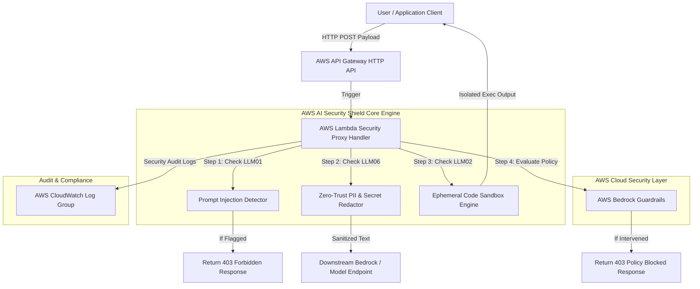
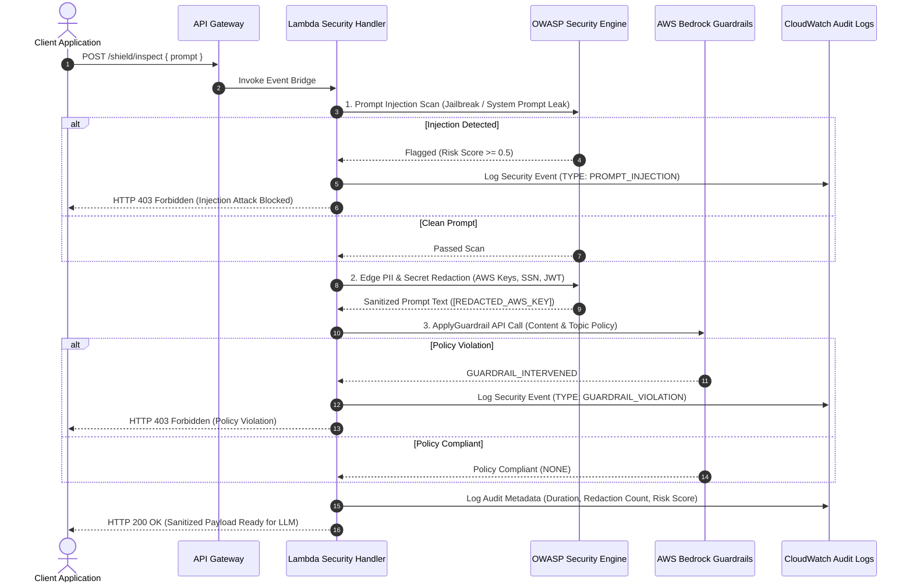
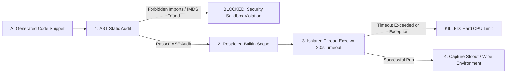

# AWS AI Security Shield Architecture Documentation

## System Topology & Security Architecture

The AWS AI Security Shield is an enterprise security gateway designed to protect generative AI applications against OWASP LLM Top 10 vulnerabilities. Built on AWS serverless primitives, it intercepts, inspects, and sanitizes both incoming prompts and outgoing LLM completions.

---

## Network & Inspection Flow Sequence Diagram

The sequence diagram below details the multi-layered evaluation pipeline for an incoming prompt payload:

---

## Ephemeral Code Execution Sandbox Architecture (OWASP LLM02 Defense)

When an AI model generates Python code snippets (e.g. data analysis or calculations), executing them directly on production application servers risks remote code execution (RCE) attacks or AWS IMDS metadata exfiltration (`169.254.169.254`).

### 4-Stage Ephemeral Sandbox Pipeline:
1. **AST Static Code Audit**: Python's `ast` module parses code into an Abstract Syntax Tree before running. Blocks forbidden builtins (`eval`, `exec`, `open`, `__import__`) and system calls (`os.system`, `subprocess`).
2. **Restricted Builtin Scope**: Strips dangerous builtins from runtime memory (`exec(code, {'__builtins__': None})`).
3. **Hard CPU Execution Limit (2.0s)**: Worker thread enforces a 2-second timeout, killing infinite loops (`while True:`).
4. **Stateless Cleanup**: Captures `stdout`/`stderr` into temporary memory buffers (`io.StringIO`), returns the response, and immediately destroys the thread context.

---

## Component Details

### 1. API Gateway HTTP API
Provides edge-rate limiting, CORS configuration, and SSL termination with low overhead.

### 2. Lambda Proxy Handler
Executes lightweight Python security middleware in under 15ms per request.

### 3. Bedrock Guardrails Policy
Managed cloud-native policy layer enforcing topic exclusion, hate/insult/violence filters, and automated PII anonymization.

### 4. Ephemeral Sandbox Engine
Isolates AI-generated code execution inside restricted scopes without system call access or AWS IMDS metadata reachability.

---

## Security Shield Visual Interface Screenshots

| Vulnerability & Defense Domain | Interactive Web UI Result |
| :--- | :--- |
| **OWASP LLM01: Prompt Injection (Blocked)** |  |
| **OWASP LLM01: Safe Prompt (Passed)** |  |
| **OWASP LLM06: Zero-Trust Secret Redaction** |  |
| **OWASP LLM02: Malicious OS Code Exec (Blocked)** |  |
| **OWASP LLM02: Safe Math Execution (Passed)** |  |
| **AWS Bedrock Guardrails Policy Intervened** |  |
| **AWS Bedrock Console Guardrail Test** |  |

